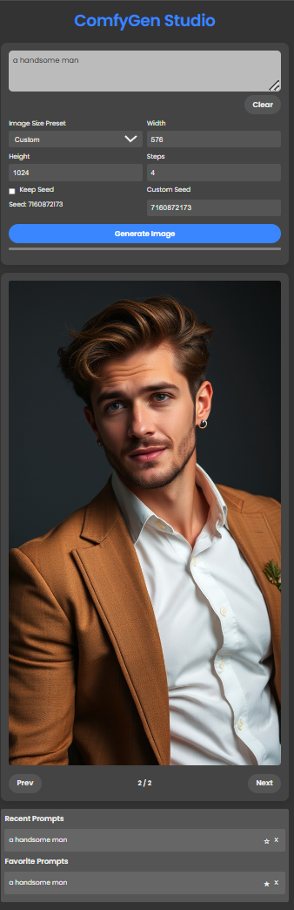

# ComfyGen Studio: A Mobile-Friendly Web Interface for ComfyUI

ComfyGen Studio is a sleek and intuitive mobile interface for ComfyUI, designed to simplify your image generation workflow on the go. This project enhances the original ComfyUI with a user-friendly interface and additional features.

This fork of ComfyGen Studio was created to bypass the limitations of ComfyUI's node-based interface on mobile devices, providing a streamlined, touch-friendly way to use the Flux image generation model directly from iPhones and iPads without dealing with complex node arrangements.

## Table of Contents
- [Project Screenshots](#project-screenshots)
- [Setting Up ComfyGen Studio](#setting-up-comfygen-studio)
- [New Features and Enhancements](#new-features-and-enhancements)
- [Using the Default Flux Workflow](#using-the-default-flux-workflow)
- [Troubleshooting](#troubleshooting)
- [Contributing](#contributing)
- [License](#license)
- [Acknowledgments](#acknowledgments)

## Project Screenshots



## Setting Up ComfyGen Studio

### Prerequisites
- ComfyUI installed
- A compatible GPU (for optimal performance)
- Basic familiarity with ComfyUI workflows

To set up ComfyGen Studio using ComfyUI, follow these steps:

1.  Clone or download this repository directly into the `ComfyUI/custom_nodes/` directory.
2.  Execute `run_nvidia_gpu.bat` or `run_cpu.bat` (or your usual ComfyUI startup script) to start the ComfyUI server.
3.  **(Optional but Recommended for Flux)** Ensure you have the necessary Flux models and nodes installed as described in the [Using the Default Flux Workflow](#using-the-default-flux-workflow) section.
4.  **(Optional) Replace the default workflow:**
    *   Enable Dev Mode Options: In the standard ComfyUI interface, click "Settings" (gear icon) and enable "Dev mode options".
    *   Generate Workflow JSON: Load *your* desired workflow in ComfyUI, then click "Save (API Format)". This saves a `.json` file representing your workflow structure.
    *   Replace Base Workflow: Replace the content of `ComfyUI/custom_nodes/comfygen/web/js/base_workflow.json` with the content of the JSON file you just saved.
    *   **Important:** Update JavaScript code if you replaced the workflow (see [Troubleshooting](#troubleshooting)).
5.  Access ComfyGen Studio: Open your web browser and navigate to `http://<your_comfyui_address>:<port>/comfygen` (e.g., `http://127.0.0.1:8188/comfygen`).

## New Features and Enhancements

ComfyGen Studio introduces several improvements:

-   **Responsive Design**: Optimized for mobile with a clean layout.
-   **Image Size Control**: Presets and custom inputs.
-   **Generation Settings**: Control steps, seed, and LoRA usage.
-   **Image History**: Navigate through generated images.
-   **Prompt Management**: Recent and favorite prompts lists.
-   **Real-time Updates**: WebSocket integration for live progress.

## Using the Default Flux Workflow

The default `base_workflow.json` is optimized for **Flux.1-dev**.

-   **Performance**: On an RTX 3070 8GB VRAM, 64GB RAM, expect ~45-50 seconds per 576x1024 prompt at 8 steps with the default LoRA.

**Required Setup for Default Workflow:**

1.  **Flux.1-dev Model**: Download `flux1-dev-fp8.safetensors` (fp8 recommended for performance/VRAM) from [Kijai/flux-fp8](https://huggingface.co/Kijai/flux-fp8/tree/main). Place it in `ComfyUI/models/checkpoints/`.
2.  **VAE**: Download the VAE from [black-forest-labs/FLUX.1-schnell](https://huggingface.co/black-forest-labs/FLUX.1-schnell/tree/main/vae). Rename `diffusion_pytorch_model.safetensors` to something clear like `flux-schnell-vae.safetensors` and place it in `ComfyUI/models/vae/`. *(Note: The default workflow doesn't explicitly load this VAE, it uses the one baked into the checkpoint. You might need to modify the workflow API JSON if you want to force a specific VAE.)*
3.  **Text Encoders**: Download `clip_l.safetensors` and `t5xxl_fp8_wrap.safetensors` from [comfyanonymous/flux_text_encoders](https://huggingface.co/comfyanonymous/flux_text_encoders/tree/main). Place them in `ComfyUI/models/clip/`.
4.  **LoRA (Optional but Defaulted ON)**: Download `Hyper-FLUX.1-dev-8steps-lora.safetensors` from [Kijai/flux-fp8](https://huggingface.co/Kijai/flux-fp8/tree/main/lora) (or another compatible LoRA). Place it in `ComfyUI/models/loras/`. The UI defaults to using this LoRA; uncheck "Use LoRA" if you don't have it or don't want to use it.
5.  **Custom Nodes**: Ensure you have the necessary custom nodes installed and updated. Use the ComfyUI Manager or install manually:
    *   FluxNodes by `comfyanonymous` (provides `FluxGuidance`, `EmptySD3LatentImage`)
    *   Potentially others depending on variations. The default workflow seems standard.
6.  **Restart ComfyUI** after placing models and installing nodes.
7.  **Performance Note**: Avoid `--lowvram` if possible, as it can significantly slow down Flux. The fp8 model is designed for better performance on lower VRAM cards.

## Troubleshooting

### Replacing the Default Workflow - Updating JavaScript

If you replaced `web/js/base_workflow.json` with your own workflow's API format JSON, you **must** update the JavaScript code in `web/js/app.js` to target the correct node IDs in *your* workflow for setting the prompt, seed, dimensions, steps, and model connections (especially for LoRA).

1.  Open `web/js/app.js`.
2.  Locate the `WORKFLOW_NODE_IDS` constant near the top of the file.
3.  Modify the string values (e.g., `'6'`, `'31'`) to match the corresponding node IDs from *your* saved API format JSON file. Find the nodes in your JSON that perform these functions:
    *   `POSITIVE_PROMPT`: The `CLIPTextEncode` node where your main positive prompt goes.
    *   `NEGATIVE_PROMPT`: (Optional) The `CLIPTextEncode` node for the negative prompt if you need to modify it.
    *   `CHECKPOINT_LOADER`: The `CheckpointLoaderSimple` (or similar) node loading your main model.
    *   `LORA_LOADER`: The `LoraLoader` node if you intend to use the LoRA checkbox.
    *   `EMPTY_LATENT`: The node creating the initial latent image (e.g., `EmptySD3LatentImage`, `EmptyLatentImage`).
    *   `KSAMPLER`: The main `KSampler` or `KSamplerAdvanced` node.
    *   `SAVE_IMAGE`: The `SaveImage` node (needed to detect when the final image is ready).
4.  Locate the section within the `queuePromptWithText` function that modifies `freshWorkflow`. Ensure the logic correctly uses your updated `WORKFLOW_NODE_IDS`. Pay special attention to the LoRA handling section, making sure it connects the `KSAMPLER`'s `model` input correctly (either to the `LORA_LOADER` output or the `CHECKPOINT_LOADER` output).

    Example snippet from `queuePromptWithText` showing where IDs are used:

    ```javascript
    // Note: These constants must match your updated WORKFLOW_NODE_IDS at the top.
    // Example uses IDs from the default Flux workflow provided.

    // Positive Prompt
    if (freshWorkflow[WORKFLOW_NODE_IDS.POSITIVE_PROMPT]?.inputs) {
         freshWorkflow[WORKFLOW_NODE_IDS.POSITIVE_PROMPT]['inputs']['text'] = text.replace(/(\r\n|\n|\r)/gm, ' ');
    }
    // Seed (KSampler)
    if (freshWorkflow[WORKFLOW_NODE_IDS.KSAMPLER]?.inputs) {
        freshWorkflow[WORKFLOW_NODE_IDS.KSAMPLER]['inputs']['seed'] = seedForThisRun;
    }
    // Dimensions (EmptyLatentImage)
    const dimensions = PromptControlUI.getWorkflowDimensions();
    if (freshWorkflow[WORKFLOW_NODE_IDS.EMPTY_LATENT]?.inputs) {
        freshWorkflow[WORKFLOW_NODE_IDS.EMPTY_LATENT]['inputs']['width'] = dimensions.width;
        freshWorkflow[WORKFLOW_NODE_IDS.EMPTY_LATENT]['inputs']['height'] = dimensions.height;
    }
    // Steps (KSampler)
    const steps = PromptControlUI.getWorkflowSteps();
    if (freshWorkflow[WORKFLOW_NODE_IDS.KSAMPLER]?.inputs) {
        freshWorkflow[WORKFLOW_NODE_IDS.KSAMPLER]['inputs']['steps'] = steps;
    }

    // Handle LoRA connection
    const loraCheckbox = getEnableLoraCheckboxElement();
    const enableLora = loraCheckbox ? loraCheckbox.checked : false;
    const kSamplerNode = freshWorkflow[WORKFLOW_NODE_IDS.KSAMPLER];

    if (kSamplerNode?.inputs) {
        if (enableLora && freshWorkflow[WORKFLOW_NODE_IDS.LORA_LOADER]) {
            // Connect KSampler to LoRA Loader
            kSamplerNode['inputs']['model'] = [WORKFLOW_NODE_IDS.LORA_LOADER, 0];
            // Ensure LoRA Loader gets model from Checkpoint Loader
            if(freshWorkflow[WORKFLOW_NODE_IDS.LORA_LOADER].inputs){
               freshWorkflow[WORKFLOW_NODE_IDS.LORA_LOADER]['inputs']['model'] = [WORKFLOW_NODE_IDS.CHECKPOINT_LOADER, 0];
            }
        } else {
            // Connect KSampler directly to Checkpoint Loader
            kSamplerNode['inputs']['model'] = [WORKFLOW_NODE_IDS.CHECKPOINT_LOADER, 0];
            // Remove LoRA node if disabling LoRA
            if (!enableLora && freshWorkflow[WORKFLOW_NODE_IDS.LORA_LOADER]) {
                delete freshWorkflow[WORKFLOW_NODE_IDS.LORA_LOADER];
            }
        }
    }
    ```

5.  Clear your browser cache and refresh the ComfyGen Studio page (`/comfygen`).

### Getting Help

If you encounter issues:

1.  **Check Browser Console:** Open your browser's developer tools (usually F12) and look for errors in the Console tab. This often pinpoints JavaScript issues.
2.  **Check ComfyUI Console:** Look at the terminal window where you started ComfyUI for backend errors (e.g., missing models, node errors).
3.  **Verify Node IDs:** Double-check that the IDs in `web/js/app.js` perfectly match the IDs in your `web/js/base_workflow.json`.
4.  **Consult ComfyUI Docs:** Refer to the official ComfyUI documentation for general workflow or node-specific questions.

## Contributing

Contributions are welcome! Fork the repository and submit a pull request with your improvements.

## License

This project is licensed under the MIT License.

## Acknowledgments

-   Original ComfyUI project by `comfyanonymous`.
-   Flux model and node developers.
-   Contributors and users of ComfyGen Studio.

## Maintenance

This fork is maintained primarily for personal use. Updates may be infrequent.
